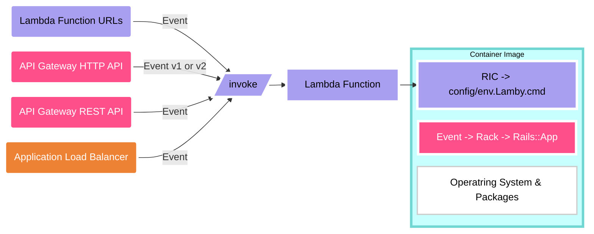

import DocLink from "../src/components/DocLink.js";
import ThemedImage from "@theme/ThemedImage";
import useBaseUrl from "@docusaurus/useBaseUrl";

I am incredibly happy to announcy Lamby v4 and a major update to our documentation website. Huge shout out to [Docusaurus](https://docusaurus.io) which has made in my opinion the best content-driven static site generator for open-source projects like our Lamby community.

<ThemedImage
  alt="Lamby: Simple Rails & AWS Lambda Integration using Rack"
  sources={{
    light: useBaseUrl("/img/lamby-rails-containers.jpg"),
    dark: useBaseUrl("/img/lamby-rails-dark.jpg"),
  }}
/>

So what is new and will v4 break anything? Lots! Mostly new ways of thinking around the same basic architecture. Nothing should break either. Lamby v4's semver change is mostly marketing driven. Here is a short list of what is new.

## Updated Starter

Want to see all this new stuff in action? Use our <DocLink id="quick-start" /> guide to deploy a new Rails application to AWS Lambda in 5min ⏱️.

## Bring Your Own Containers

Lamby still works with the Zip packaging format, but all documentation on how to use it has been removed. Containers are here to stay and their value goes way past a simple packaging format.



We now encourage bringing your own containers by using Lambda's Runtime Interface Client (RIC). The RIC allows us to use Docker's `CMD` to load Rails and invoke a function. In this case we are loading our Rails application through its config/environment.rb file (.rb extension is implied) and once that is done, calling the new `Lamby.cmd` as the Lambda handler. No more `app.rb`
file needed!

```docker title="Dockerfile"
FROM ruby:3.2-bullseye
RUN gem install 'aws_lambda_ric'
ENTRYPOINT [ "/usr/local/bundle/bin/aws_lambda_ric" ]
CMD ["config/environment.Lamby.cmd"]
```

## Secrets with Crypteia

The [Crypteia](https://github.com/rails-lambda/crypteia) package is Rust Lambda Extension for any Runtime/Container to preload SSM Parameters as secure environment variables. It takes advantages of `LD_PRELOAD` to seamlessly fetch values from SSM when a process starts and then injects them as natively accesible Ruby `ENV` variables. Our <DocLink id="quick-start" /> guide's cookiecutter includes Crypteia already for you via a Docker `COPY` command into the Lambda Extension `/opt` directory.

```docker title="Dockerfile"
FROM ruby:3.2-bullseye
# highlight-next-line
COPY --from=ghcr.io/rails-lambda/crypteia-extension-debian:1 /opt /opt
```

Usage is simply done by adding variables to your SAM template and accessing the values fetched from SSM like any other environment variable. Please read the Crypteia's [documentation](https://github.com/rails-lambda/crypteia) for full details.

```title="template.yaml"
Globals:
  Environment:
    Variables:
      SECRET: x-crypteia-ssm:/myapp/SECRET
```

```ruby
ENV['SECRET'] # 1A2B3C4D5E6F
```

## Development Containers

Described in the <DocLink id="quick-start" /> guide, our Lamby starter makes use of the [Development Container](https://containers.dev) specification via a [`.devcontainer`](https://github.com/rails-lambda/lamby-cookiecutter/tree/master/%7B%7Bcookiecutter.project_name%7D%7D/.devcontainer) directory. Commonly used with Codespaces, dev containers can be used locally with any editor.

Our dev container's `Dockerfile` uses the same base image as the one at the root of your project. This helps ensure your development experience, like installing system dependencies and Ruby gems with native extensions, aligns with the same process as your production image.

We also leverage the devcontainer's `dockerComposeFile` capability to include a MySQL service as well. The Lamby starter also includes a range of [devcontainer features](https://containers.dev/features) which are installed within the Ubuntu development image. For example, Node, Docker in Docker, SSH, and the AWS CLI & SAM CLI.
