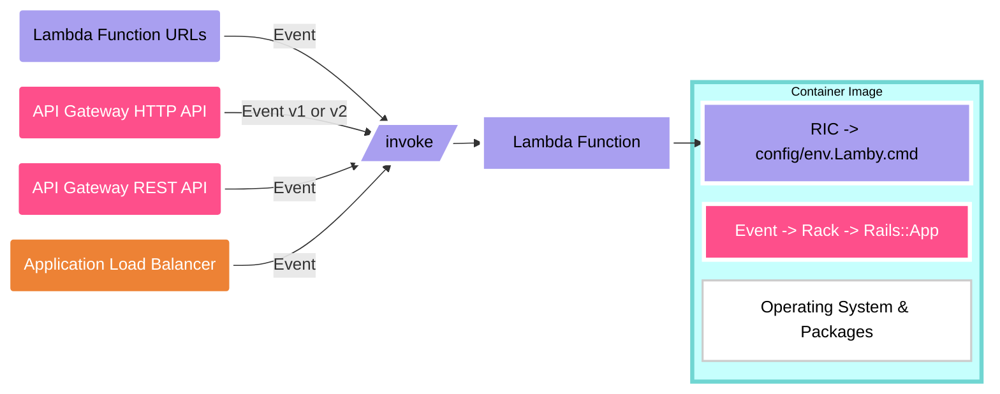

import DocLink from "../src/components/DocLink.js";
import ThemedImage from "@theme/ThemedImage";
import useBaseUrl from "@docusaurus/useBaseUrl";

# How Lamby Works

The quickest way to see Lamby in action is to create a new Rails app via our cookiecutter project template using our <DocLink id="quick-start" /> guide. This guide will instead outline what is happening within that starter project allowing you to cherry-pick which files and/or practices from our [cookiecutter](https://github.com/rails-lambda/lamby-cookiecutter) project can be applied to your own application(s).

:::note
If you copy any template files without using the cookiecutter, remember to customize the `` template sections with your own app name and remove the curly bracket sections like these `{{ "..." }}` from various string literals.
:::

## Architecture

Lamby is a Rack adapter that converts AWS Lambda integration events into native [Rack Environment](https://github.com/rack/rack/blob/master/SPEC.rdoc) objects which are sent directly to your application. Lamby can automatically do this when using either Lambda Function URLs, API Gateway HTTP API v1/v2 payloads, API Gateway REST API, or even Application Load Balancer (ALB) integrations.



Since Rails applications are Rack applications, Lamby removes the need for a companion [Rack Web Server](https://github.com/rack/rack#supported-web-servers) like Passenger or Puma to be running within your container. Essentially AWS integrations become your web server and scaling is managed by the Lambda service spinning up new container instances, one for each request or down to zero if needed. Lambda instances live for several minutes or more. A small pool of concurrent fuctions can handle a large amount of traffic.

## Install Lamby

Start by adding the Lamby gem to your `Gemfile`. It remains inert until it detects special environment variables present when run on AWS Lambda. When activated, it mostly does a few simple things like ensuring Rails logs to standard out.

```ruby
gem 'lamby'
```

## Runtime Container

You will need some [`Dockerfile`](https://github.com/rails-lambda/lamby-cookiecutter/blob/master/%7B%7Bcookiecutter.project_name%7D%7D/Dockerfile) to build your Lambda container image. Referencing architecture diagram above mentions something called a RIC (Rick). The RIC is short for the Lambda [Runtime Interface Client](https://github.com/aws/aws-lambda-ruby-runtime-interface-client). It is a small interface packaged as a Ruby gem that acts as the `ENTRYPOINT` for any [OCI](https://opencontainers.org) container image to run on the AWS Lambda platform. Below you can see that we are using an [Official Ruby](https://hub.docker.com/_/ruby) Ubuntu variant base image, installing the RIC and setting it as the entrypoint.

```docker title="Dockerfile"
FROM ruby:3.2-bullseye

RUN gem install 'aws_lambda_ric'
ENTRYPOINT [ "/usr/local/bundle/bin/aws_lambda_ric" ]
CMD ["config/environment.Lamby.cmd"]
```

The RIC allows us to use Docker's `CMD` to load Rails and invoke a function. In this case we are loading our Rails application through its `config/environment.rb` file (.rb extension is implied) and once that is done, calling the `Lamby.cmd` as the Lambda handler.

:::note
Our [cookiecutter](https://github.com/rails-lambda/lamby-cookiecutter) project defaults to building a Linux image targeting the `arm64` architecture vs the traditional `x86_64`. However, this is easily changed to accomodate your needs. Check out the <DocLink id="cpu" /> section for more details.
:::

## SAM CloudFormation File

The [`template.yaml`](https://github.com/rails-lambda/lamby-cookiecutter/blob/master/%7B%7Bcookiecutter.project_name%7D%7D/template.yaml) file at the root of your project describes your [Serverless Application](https://docs.aws.amazon.com/serverless-application-model/latest/developerguide/what-is-sam.html). Don't worry, we have done some heavy lifting for you. Here is the [Serverless Function](https://docs.aws.amazon.com/serverless-application-model/latest/developerguide/sam-resource-function.html) Resource we start you off with and a brief explanation:

```yaml title="template.yaml"
RailsLambda:
  Type: AWS::Serverless::Function
  Metadata:
    DockerContext: .
    Dockerfile: Dockerfile
    DockerTag: web
  Properties:
    AutoPublishAlias: live
    FunctionUrlConfig:
      AuthType: NONE
    DeploymentPreference:
      Type: AllAtOnce
    MemorySize: 1792
    PackageType: Image
    Timeout: 30
```

- Your Rails function will have a `MemorySize` of 1,792 MB of RAM and 1 vCPU. This is the sweet spot for Rails speed and cost optimization. Remember, you're not running a web server in a single function nor scaling by memory.
- The `FunctionUrlConfig` has been configured to be a public HTTP proxy. You can change this to IAM authentication or swap out to other web server integrations like API Gateway if you need their features. Details in other guides.
- The maximum amount of `Timeout` for an HTTP integration is 30 seconds.


As your application grows you may end up adding Resources like EventBridge Rules, SQS, S3 Buckets, and IAM Policies. Please take some time to learn how SAM & CloudFormation work.

- [What Is the AWS Serverless Application Model (AWS SAM)?](https://docs.aws.amazon.com/serverless-application-model/latest/developerguide/what-is-sam.html)
- [Quick Intro & Tech Spec for SAM File](https://github.com/awslabs/serverless-application-model/blob/master/versions/2016-10-31.md)
- [What is AWS CloudFormation?](https://docs.aws.amazon.com/AWSCloudFormation/latest/UserGuide/Welcome.html)

## Development Container

Described in the <DocLink id="quick-start" /> guide, our Lamby starter makes use of the [Development Container](https://containers.dev) specification via a [`.devcontainer`](https://github.com/rails-lambda/lamby-cookiecutter/tree/master/%7B%7Bcookiecutter.project_name%7D%7D/.devcontainer) directory. Commonly used with Codespaces, dev containers can be used locally with any editor.

Our dev container's `Dockerfile` uses the same base image as the one at the root of your project. This helps ensure your development experience, like installing system dependencies and Ruby gems with native extensions, aligns with the same process as your production image.

We also leverage the devcontainer's `dockerComposeFile` capability to include a MySQL service as well. The Lamby starter also includes a range of [devcontainer features](https://containers.dev/features) which are installed within the Ubuntu development image. For example, Node, Docker in Docker, SSH, and the AWS CLI & SAM CLI.

:::note
Technically you do not need to adopt these devcontainer patterns, but it is really nice to be able to use this container to ensure your CI/CD process is reproducable locally using VS Code or the [Dev Container CLI](https://github.com/devcontainers/cli). More details in the following CI/CD section.
:::

## Deployment & CI/CD

So how does that CloudFormation file and container image get created within AWS? We use the AWS SAM CLI's `build`, `package`, and `deploy` commands in a single [`bin/deploy`](https://github.com/rails-lambda/lamby-cookiecutter/blob/master/%7B%7Bcookiecutter.project_name%7D%7D/bin/deploy) file. This file also does the following. Feel free to customize your deploy files as needed:

- Finds/Creates an ECR repository with the same name as your project.
- Sets various ENV variables if not set already. For example, easy to deploy to multiple regions by setting `AWS_REGION`.
- Install gems into local vendor/bundle for deployment via a Docker `COPY`.

If you used our <DocLink id="quick-start" /> guide, you likely made your first deploy using VS Code's integrated terminal within the development container. This is critically important since your Ruby gems with native extensions are built within the context of the Ruby Ubuntu image being built and copied to ECR for Lambda to use.

When automating deployments, the system must have permission to create the needed resources and IAM Roles with permission(s) for your application to work. Most hobby users have admin level access to their own AWS account. For more security minded folks, consider creating a [least privilege user](https://docs.aws.amazon.com/lambda/latest/dg/access-control-identity-based.html) for your deployments with [OpenID Connect](https://docs.aws.amazon.com/IAM/latest/UserGuide/id_roles_providers_create_oidc.html) identity providers. We found that the `AWSCodeDeployFullAccess` managed policy is often overlooked.

### CircleCI

If `arm64` is your target platform in production, CircleCI make it easy to to do so using their [Arm Execution Environment](https://circleci.com/docs/using-arm/). Our starter includes a CircleCI `config.yml` file that runs tests on each commit or deploy by manually triggering a workflow. It even uses the [Devcontainer CLI](https://github.com/devcontainers/cli) to ensure your CI/CD matches your development experience. Changing between `arm64` and `x86_64` is described in our <DocLink id="cpu" /> guide.

- [Test & Deploy CircleCI Template](https://github.com/rails-lambda/lamby-cookiecutter/blob/master/%7B%7Bcookiecutter.project_name%7D%7D/.circleci/config.yml)

Deploying requires manually triggering the workflow. Simply select a branch then click "Trigger Workflow" and pass a string parameter called "workflow" with a value of "deploy". Feel free to change this workflow to suite your needs.

<ThemedImage
  alt="CircleCI Trigger Workflow for Deploy"
  sources={{
    light: useBaseUrl("/img/docs/circle-ci-trigger-workflow-light.png"),
    dark: useBaseUrl("/img/docs/circle-ci-trigger-workflow-dark.png"),
  }}
/>

### GitHub Actions

You can automate both the test and deploy process using our provided GitHub Actions which also leverage the [Dev Container Build and Ruby CI](https://github.com/devcontainers/ci) project.

- [Deploy GitHub Action Template](https://github.com/rails-lambda/lamby-cookiecutter/blob/master/%7B%7Bcookiecutter.project_name%7D%7D/.github/workflows/deploy.yml)
- [Test GitHub Action Template](https://github.com/rails-lambda/lamby-cookiecutter/blob/master/%7B%7Bcookiecutter.project_name%7D%7D/.github/workflows/test.yml)

1. Within your project's GitHub repository [add two Encrypted Secrets](https://docs.github.com/en/actions/reference/encrypted-secrets) using the credentials values above with the environment names of `AWS_ACCESS_KEY_ID` and `AWS_SECRET_ACCESS_KEY`.
2. If needed, change the `aws-region` in your `.github/workflows/deploy.yml` file from `us-east-1` to your own region.
3. Trigger a deploy by navigating to the Deploy workflow and clicking "Run workflow".


